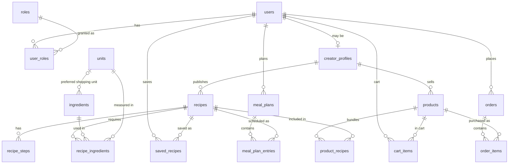

# Cookfeed — Assignment 2: Database Design Document

**Jeff Gulick** · Cookfeed: A Short-Video Recipe Marketplace · Deliverable 2 of the semester project

---

## 1. Purpose and scope

Cookfeed is a short-video recipe marketplace: home cooks discover recipes through video, save them, turn saved and planned recipes into a single shopping list, and buy recipe collections and meal plans from creators. This deliverable is the data layer that everything else in the project stands on:

| Deliverable | Where it lives |
|---|---|
| 1. ER diagram and normalized (3NF) schema as EF Core entities and migration | `docs/ERDiagram.mermaid`, `docs/schema.sql`, `src/Cookfeed.Domain/Entities/*.cs`, `src/Cookfeed.Infrastructure/Persistence/CookfeedDbContext.cs`, `Persistence/Configurations/*.cs`, `Persistence/Migrations/` |
| 2. Seed data | `src/Cookfeed.Infrastructure/Persistence/Seed/DbSeeder.cs` (mirrors `docs/sql/seed.sql`) |
| 3. Core queries in LINQ, generated SQL reviewed, indexes justified | `src/Cookfeed.Infrastructure/Persistence/Queries/*Reader.cs` behind the ports in `src/Cookfeed.Application/Abstractions/Persistence`, `docs/Queries.md` |
| 4. Design document | this file |
| 5. ASP.NET Core API layer with tests | `src/Cookfeed.Api/Endpoints/*.cs` over handlers in `src/Cookfeed.Application`, `tests/Cookfeed.Domain.Tests/*.cs`, `tests/Cookfeed.IntegrationTests/*.cs` |

**Stack:** ASP.NET Core 10 (minimal APIs), EF Core 10, Npgsql, PostgreSQL 16, laid out as Clean Architecture (`Domain` → `Application` → `Infrastructure` → `Api`, dependencies pointing inward). Table and column names use `snake_case` via the `EFCore.NamingConventions` package so the SQL reads naturally in `psql`. Angular (Assignment 4) will consume the API.

**Why relational.** The two features the product is built around are joins and grouped aggregations. A shopping list is *"every ingredient across every recipe this user saved or planned, grouped by ingredient, summed"*. Order history is *"orders → order items → products → creators"*. Both are one `SELECT` with `JOIN`/`GROUP BY` in SQL and would be multi-round-trip application code over a document store. PostgreSQL also gives me `CHECK` constraints, real foreign keys, `numeric` for quantities, and `DELETE`-cascade semantics that encode business rules in the database rather than trusting every caller.

---

## 2. Entity-relationship diagram



The full attribute-level diagram is in `docs/ERDiagram.mermaid` (renders in GitHub, VS Code, and mermaid.live).

### Table inventory

| # | Table | Purpose | Key |
|---|---|---|---|
| 1 | `users` | Every account | `id` |
| 2 | `roles` | HomeCook / Creator / Admin lookup | `id` |
| 3 | `user_roles` | Many-to-many user↔role | `(user_id, role_id)` |
| 4 | `creator_profiles` | Storefront data; 1:1 with `users`, only for creators | `user_id` (shared PK) |
| 5 | `recipes` | The video + metadata | `id` |
| 6 | `recipe_steps` | Ordered instructions, tied to video timestamps | `id`, unique `(recipe_id, step_number)` |
| 7 | `units` | Measurement units with category and base-conversion factor | `id` |
| 8 | `ingredients` | **Canonical** ingredient catalog with density | `id` |
| 9 | `recipe_ingredients` | Many-to-many recipe↔ingredient with quantity + unit | `id` |
| 10 | `saved_recipes` | User saved (liked) a recipe | `(user_id, recipe_id)` |
| 11 | `meal_plans` | One per user per week | `id`, unique `(user_id, week_start)` |
| 12 | `meal_plan_entries` | Recipe on a day/slot, optionally rescaled | `id` |
| 13 | `products` | Sellable collection or meal plan | `id` |
| 14 | `product_recipes` | Which recipes a product bundles (+ day/slot for meal plans) | `(product_id, recipe_id)` |
| 15 | `cart_items` | The cart, one row per product | `(user_id, product_id)` |
| 16 | `orders` | Order header | `id` |
| 17 | `order_items` | Purchased products with price/title snapshot | `id`, unique `(order_id, product_id)` |

The proposal estimated 12–14 tables; the final count is 17. The three "extra" tables are `units` (the proposal folded units into ingredients; §6 explains why that was wrong), `recipe_steps` (steps were going to be a text column; splitting them lets each step carry a video timestamp), and `product_recipes` (a product must reference many recipes, which cannot be a column). Nothing was added for its own sake — each table exists because a column could not hold the data without repeating groups.

---

## 3. Normalization

The schema is in third normal form. Rather than restate the definitions, here are the places where 3NF forced a decision and what it was.

**Repeating groups removed (1NF).** A recipe has many steps and many ingredients. Both are child tables, not text blobs or JSON arrays. That is what makes ingredient aggregation possible at all: `recipe_ingredients` has one row per (recipe, ingredient) with a typed `numeric` quantity and a foreign key to a unit. A JSON `ingredients` column on `recipes` would have been faster to write and would have made the shopping list impossible in SQL.

**Partial dependencies removed (2NF).** In the junction tables with composite keys (`user_roles`, `saved_recipes`, `product_recipes`, `cart_items`) every non-key column depends on the whole key. `saved_at` depends on *this user saving this recipe*, not on the user or the recipe alone. `day_offset` and `slot` in `product_recipes` describe *this recipe's place in this product*. Nothing about the user or the recipe themselves lives in these tables.

**Transitive dependencies removed (3NF).** The clearest example is the unit. A recipe ingredient line says "2 cups". The fact that a cup is a *volume* unit of 236.588 ml depends on the unit, not on the recipe ingredient. So `unit_category` and `to_base_factor` live on `units`, and `recipe_ingredients` carries only `unit_id`. Likewise an ingredient's aisle category and density depend on the ingredient, so they live on `ingredients`, referenced by FK. A creator's handle and bio depend on the creator, not on each recipe they publish, so they live on `creator_profiles`.

**Decisions where normalization shaped the table list:**

- **`creator_profiles` is a separate 1:1 table, not columns on `users`.** Handle, bio, avatar, and verification status are null for the majority of users (home cooks). Splitting them out avoids a wide, mostly-null user row, gives `recipes.creator_id` and `products.creator_id` a foreign key that *guarantees the referenced user is a creator*, and keeps the storefront URL lookup (`handle`) on a small table. The shared primary key (`creator_profiles.user_id` is both PK and FK) enforces at-most-one profile per user without an extra unique index.

- **Roles are a junction table, not an enum column.** A creator is also a home cook — they save and buy like anyone else. A single `role` column would force a choice; `user_roles` lets one user hold both.

- **There is no `carts` table.** A cart header would contain nothing but `user_id`. The cart *is* the set of `cart_items` rows for a user, keyed `(user_id, product_id)`. The composite key doubles as the rule "a product is in your cart once or not at all", which is correct for digital goods.

- **`order_items` has no `quantity`.** Products are digital (a collection, a plan). Buying one twice is meaningless, and the unique index on `(order_id, product_id)` enforces that. Dropping the column is more honest than a `quantity` that is always 1.

- **Products bundle recipes through `product_recipes`.** A meal-plan product is the same shape as a collection plus a `day_offset` and `slot` per recipe. One `products` table with a `type` discriminator and nullable placement columns was chosen over two tables because the cart, orders, and storefront treat both identically. The `CHECK (day_offset BETWEEN 0 AND 6)` constraint keeps the nullable columns honest.

---

## 4. Constraints and referential integrity

Every relationship is a real foreign key. The delete behavior was chosen per relationship, not left at a default:

| Relationship | On delete | Reason |
|---|---|---|
| `users` → `user_roles`, `saved_recipes`, `meal_plans`, `cart_items`, `creator_profiles` | **CASCADE** | These rows are meaningless without the user; deleting an account should remove them. |
| `users` → `orders` | **RESTRICT** | Financial history must survive. Account deletion must be handled as a soft delete / anonymization, not a hard delete. The database refuses to let the app get this wrong. |
| `creator_profiles` → `recipes`, `products` | CASCADE | A creator's catalog goes with their profile. |
| `recipes` → `recipe_steps`, `recipe_ingredients`, `saved_recipes`, `meal_plan_entries` | CASCADE | Child rows of the recipe. |
| `recipes` ← `product_recipes` | **RESTRICT** | A recipe that has been sold as part of a product cannot be deleted out from under buyers. Unpublish it instead (`is_published = false`). |
| `ingredients`, `units` ← `recipe_ingredients` | **RESTRICT** | Catalog rows in use cannot be deleted. |
| `products` ← `order_items` | **RESTRICT** | Same reason as recipes: purchased products stay. Use `is_active = false`. |
| `products` ← `cart_items` | CASCADE | An unsold product vanishing from carts is fine. |
| `roles` ← `user_roles` | RESTRICT | Roles are static lookup data. |
| `units` ← `ingredients.preferred_shopping_unit_id` | SET NULL | A preference, not a requirement; the shopping list falls back to the base unit. |

**Uniqueness** (all enforced by unique indexes, not application checks): `users.email`, `roles.name`, `creator_profiles.handle`, `units.name`, `units.abbreviation`, `ingredients.name`, `(recipe_id, step_number)`, `(user_id, week_start)` on meal plans, `(order_id, product_id)` on order items, plus every composite primary key.

**Check constraints** encode invariants that would otherwise be scattered across validation code:

```sql
ck_recipes_servings_positive                 servings > 0
ck_recipes_published_has_date                is_published = false OR published_at IS NOT NULL
ck_recipe_steps_number_positive              step_number > 0
ck_units_factor_positive                     to_base_factor > 0
ck_ingredients_density_positive              density_g_per_ml IS NULL OR density_g_per_ml > 0
ck_recipe_ingredients_quantity_positive      quantity > 0
ck_meal_plan_entries_servings_positive       servings_override IS NULL OR servings_override > 0
ck_product_recipes_day_offset_range          day_offset IS NULL OR day_offset BETWEEN 0 AND 6
ck_products_price_nonnegative                price_cents >= 0
ck_orders_total_nonnegative                  total_cents >= 0
ck_order_items_price_nonnegative             unit_price_cents >= 0
ck_creator_profiles_handle_slug              handle ~ '^[a-z0-9]+(?:-[a-z0-9]+)*$'
```

`ck_recipes_servings_positive` matters more than it looks: the shopping list divides by `servings` to scale a recipe. A zero would be a division-by-zero in the query, so the database refuses it at insert.

**Types.** Money is integer cents (`price_cents`, `total_cents`, `unit_price_cents`) with a 3-letter `currency` column — never floating point. Quantities are `numeric(10,3)`; conversion factors `numeric(12,6)`; density `numeric(8,4)`. All timestamps are `timestamptz` stored in UTC; calendar dates (`week_start`, `planned_date`) are `date`, because "Monday the 21st" is not an instant. Enums (`unit category`, `meal slot`, `product type`, `order status`) are stored as short `varchar` rather than PostgreSQL enum types so that adding a value is an `INSERT`-compatible change rather than an `ALTER TYPE`, and so the values are readable in `psql`.

---

## 5. Where I chose to denormalize

Three deliberate departures from 3NF, each with the derivation rule and how it stays correct.

**1. `recipes.save_count`.** Derivable as `COUNT(*) FROM saved_recipes WHERE recipe_id = ?`. The feed is the most-read page in the application and the "Trending" sort orders by this number; computing it per row with a correlated subquery, then sorting, defeats any index. The counter is maintained inside the same transaction as the `saved_recipes` insert/delete, using `UPDATE recipes SET save_count = save_count + 1` (EF `ExecuteUpdate`) — an atomic SQL increment, not a read-modify-write in C#, so concurrent saves cannot lose updates. It is indexed together with `is_published` so the trending feed is an index scan.

**2. `orders.total_cents`.** Derivable as `SUM(unit_price_cents) FROM order_items`. Stored because an order total is a fact about a transaction that happened: if a line item were ever corrected or refunded independently, the original total should still be visible. It is written once at checkout and never updated. Tests assert it equals the sum of its items.

**3. `order_items.product_title`, `unit_price_cents`, `creator_id`.** These duplicate columns on `products`. They are **snapshots**: a creator can rename or reprice a product tomorrow, and order history must show what the buyer actually paid for, at the price they paid. `creator_id` is copied so that a creator-earnings report can group order items by creator without joining through `products` — and so it still works if a product is ever reassigned. This is the standard e-commerce pattern; the normalized alternative (a `product_versions` table) was more machinery than the project needs.

Not denormalized, on purpose: the shopping list. It is always computed from `saved_recipes` + `meal_plan_entries` + `recipe_ingredients`, never stored, because it changes with every save and every plan edit and is cheap to compute for one user.

---

## 6. The ingredient and unit model

This is the design problem the whole product hangs on. The requirement: a user saves a focaccia recipe calling for **500 g all-purpose flour**, a pancake recipe calling for **2 cups all-purpose flour**, and a cookie recipe calling for **2¼ cups flour**. The shopping list must show **one line: all-purpose flour, ~1,033 g** — not three.

Three separate problems are hiding in that sentence, and the model solves each with a separate mechanism.

### 6.1 "Which ingredient?" — canonical ingredients

Recipes never store ingredient names. `recipe_ingredients.ingredient_id` points at a single canonical row in `ingredients` (`name` is unique). "flour", "AP flour", and "all-purpose flour" on three recipes are three foreign keys to the same row, which is what lets `GROUP BY ingredient_id` work. What the creator actually typed is preserved in `recipe_ingredients.display_text` for the recipe page and is never used for aggregation.

*Deferred:* an `ingredient_aliases` table (`alias → ingredient_id`) so the creator-facing recipe editor can map free text to canonical rows automatically. The seed data maps ingredients directly; the alias table is an Assignment 3/4 concern and slots in without changing anything here.

### 6.2 "Are these the same kind of amount?" — unit categories and base units

Every unit belongs to exactly one **category** — `Volume`, `Mass`, or `Count` — and stores `to_base_factor`, its multiplier to that category's base unit (ml, g, or 1):

| unit | category | to_base_factor |
|---|---|---|
| teaspoon | Volume | 4.92892 |
| cup | Volume | 236.588 |
| millilitre | Volume | 1 |
| ounce | Mass | 28.3495 |
| gram | Mass | 1 |
| each, clove, can, bunch | Count | 1 |

Within a category, aggregation is purely arithmetic: `SUM(quantity × to_base_factor)`. This is done **in SQL**, grouped by `(ingredient_id, unit category)`. Adding a unit is an `INSERT` into `units`; no code changes.

Categories are not mixed by the database. "3 cloves garlic" and "15 g garlic" would come back as two groups for the same ingredient, and that is correct — count and mass are not interconvertible in general.

### 6.3 "Can volume and mass be reconciled?" — density

`ingredients.density_g_per_ml` is nullable. When present, the application converts the ingredient's Volume group to Mass: `ml × density = g`. Flour is 0.53 g/ml, so 2 cups = 473.2 ml = 250.8 g, and the three flour lines above collapse:

```
500 g  (focaccia, already mass)
+ 2.00 cups × 236.588 × 0.53 = 250.78 g   (pancakes)
+ 2.25 cups × 236.588 × 0.53 = 282.13 g   (cookies)
= 1032.91 g
```

When density is unknown (`NULL`), the groups are **kept apart and shown separately** rather than guessed. The shopping list DTO returns them in an `unmerged` list so the UI can show "mozzarella — 200 g" and "mozzarella — 1 cup" as two lines. Wrong merges are worse than no merges: a user who buys half the cheese they need will not trust the list again.

### 6.4 "What unit should the line be in?" — preferred shopping unit

`ingredients.preferred_shopping_unit_id` says how to present the aggregate: flour in grams, milk in millilitres, eggs by count. After merging, the base quantity is divided by the preferred unit's `to_base_factor`. If the preferred unit's category has no data (an ingredient with only Count rows but a Mass preference), the line falls back to the base unit of whatever category it has.

### 6.5 Division of labor: SQL vs. application

```
SQL  (one query, GROUP BY)             C#  (per ingredient, in memory)
─────────────────────────────          ───────────────────────────────
which recipes, at what scale     →     Volume→Mass via density
JOIN recipe_ingredients          →     choose main vs unmerged lines
× to_base_factor, SUM by         →     express in preferred unit
(ingredient, unit category)      →     round, sort by aisle
```

The database does the part that benefits from being close to the data (the join and the sum over potentially hundreds of rows). The application does the part that is a *policy* — when to merge, when to refuse, how to present — because policies change and are far easier to unit-test in C# than in SQL. The C# half lives in `ShoppingListAggregator` (pure, no EF), which is why `tests/Cookfeed.Domain.Tests` can pin the flour example to ±0.5 g without a database.

### 6.6 Scaling

A meal plan entry can override servings: Alex plans a 2-serving teriyaki for 4 people. The recipe set query computes `scale = servings_override / recipe.servings` per entry and multiplies every ingredient quantity by it in the same `SUM`. Saved-but-not-planned recipes scale at 1. A recipe that is both saved and planned counts once, at the planned scale (`NOT EXISTS` against the planned set). A recipe planned on two different nights counts twice — you are cooking it twice. These rules are each covered by a test.

---

## 7. Indexing summary

Every read-side query is paired with the index that serves it in `docs/Queries.md`. The short version:

- **Feed:** `(is_published, published_at DESC)` and `(is_published, save_count DESC)` — the `WHERE is_published ORDER BY … LIMIT` shape becomes a forward index scan that stops after one page.
- **Storefront:** unique `handle`; `recipes(creator_id)`; `products(creator_id, is_active)`.
- **Shopping list:** composite PK `saved_recipes(user_id, recipe_id)`; unique `meal_plans(user_id, week_start)`; `meal_plan_entries(meal_plan_id, planned_date, slot)`; `recipe_ingredients(recipe_id, sort_order)`.
- **Order history:** `orders(user_id, placed_at DESC)`; unique `order_items(order_id, product_id)`.
- **Every foreign key** has a supporting index so `RESTRICT`/`CASCADE` checks and reverse lookups ("recipes using this ingredient", "who bought this product") do not table-scan. PostgreSQL does not create these automatically; EF Core does, and the reference DDL lists them explicitly.

No index was added speculatively. Each one corresponds to a `WHERE`, `JOIN`, or `ORDER BY` in a real query in this repository.

---

## 8. Deliberately out of scope for this assignment

- **Authentication.** `password_hash` is stored (never plaintext), but login, JWTs, and authorization arrive with the Angular work in Assignment 4. The API identifies the viewer by an `X-User-Id` header for now.
- **Payments.** Checkout creates a `Paid` order with a simulated `payment_reference`. A Stripe-style provider would move the order through `Pending → Paid` and populate the reference.
- **Ingredient aliases and creator-side ingredient entry** (§6.1).
- **Video storage.** `video_url` is a URL; upload/transcoding is infrastructure, not schema.
- **Entitlements table.** "Does this user own this product?" is answered by `EXISTS (order_items JOIN orders WHERE status = 'Paid')`. If refunds and gifting arrive, a materialized `entitlements` table would replace that subquery; the storefront query is the only place that would change.
